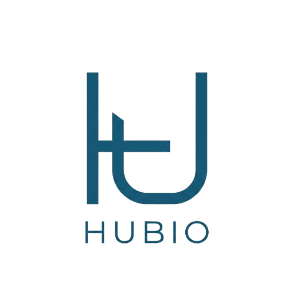

<!-- SEO: Hubio, negocios, marketplace, digitalización, LATAM, SaaS, comercio, empresas -->

<div align="center">



<h1>
  <span style="background: linear-gradient(135deg, #2563EB 0%, #3B82F6 50%, #1E3A8A 100%); -webkit-background-clip: text; -webkit-text-fill-color: transparent; background-clip: text;">
    Hubio
  </span>
</h1>

<p><strong>Donde los negocios se conectan.</strong></p>

<p>
  <a href="https://nextjs.org/"></a>
  <a href="https://www.typescriptlang.org/"></a>
  <a href="https://tailwindcss.com/"></a>
  <a href="https://www.prisma.io/"></a>
  
  
</p>

<p>
  
  
  
</p>

</div>

---

<table width="100%">
<tr>
<td width="50%" valign="top">

### Plataforma

**Hubio** es un **SaaS marketplace** para **empresas**, **profesionales** y **anunciantes** en **Latinoamérica**. Unifica publicidad exterior, servicios freelance, empleo, comunidad y herramientas de negocio en una sola experiencia web moderna.

Palabras clave: **Hubio**, **negocios**, **marketplace**, **digitalización**, **LATAM**, **SaaS**, **comercio**, **empresas**.

</td>
<td width="50%" valign="top">

<div style="background: linear-gradient(145deg, #F8FAFC 0%, #FFFFFF 100%); border: 1px solid #E2E8F0; border-radius: 16px; padding: 20px; box-shadow: 0 4px 24px rgba(37, 99, 235, 0.08);">

**Estado del producto**

| Área | En producción |
|------|----------------|
| Marketplace Ads | ✓ |
| Servicios & Empleos | ✓ |
| Feed & Mensajes | ✓ |
| Checkout Stripe | ✓ |
| POS & Dashboard | ✓ |
| Admin & Moderación | ✓ |

</div>

</td>
</tr>
</table>

---

## Descripción

Hubio conecta oferta y demanda comercial: desde **espacios publicitarios** (vallas, pantallas, tótems) hasta **servicios profesionales**, **vacantes**, **perfiles de empresa** y un **feed corporativo**. Incluye pasarela de pagos, panel de pedidos, punto de venta (POS), herramientas internas y panel administrativo.

La interfaz implementa un diseño de alta gama que incluye **modo oscuro**, **glassmorphism**, y la paleta **Hubio Blue** (`#2563EB`, `#3B82F6`, `#1E3A8A`). Cuenta con **diseños y animaciones SVG premium** como un logotipo dinámico auto-dibujable con **Framer Motion** y una red de conexiones animada interactiva que representa el ecosistema de negocios en la landing page.

---

## Funcionalidades principales

| Módulo | Ruta / área | Qué hace |
|--------|-------------|----------|
| **Hubio Ads** | `/anuncios`, `/publicar` | Marketplace de espacios publicitarios, reservas y gestión de “mis espacios”. |
| **Hubio Services** | `/servicios` | Directorio de servicios freelance, publicación, edición y fichas de detalle. |
| **Hubio Jobs** | `/empleos` | Bolsa de empleo, postulaciones y gestión de vacantes. |
| **Comunidad** | `/feed`, `/explorar` | Feed social, interacciones y descubrimiento de perfiles. |
| **Mensajería** | `/mensajes` | Chat entre usuarios (con soporte vía Socket.IO en API legacy). |
| **Checkout** | `/checkout` | Flujos de pago (Stripe) para servicios y anuncios. |
| **Dashboard** | `/dashboard` | Panel del usuario: pedidos, clientes, postulantes, creación de contenido. |
| **POS** | `/dashboard/pos` | Punto de venta, inventario, configuración e informes. |
| **Hubio Tools** | `/herramientas` | Utilidades premium para productividad y negocio. |
| **Asistente IA** | `/asistente` | Consultas inteligentes sobre SEO, precios, ROI, contratos y branding con 8 agentes especializados. |
| **Admin** | `/admin` | Usuarios, finanzas, badges, reportes y configuración global. |
| **Perfil & auth** | `/login`, `/register`, `/perfil` | Cuentas, 2FA, configuración y perfiles públicos. |

---

## Capturas y demo

<div align="center">

<table>
<tr>
<td align="center" width="33%">
<br/>

<br/><sub>Inicio — hero y módulos</sub>
</td>
<td align="center" width="33%">
<br/>

<br/><sub>Dashboard del negocio</sub>
</td>
<td align="center" width="33%">
<br/>

<br/><sub>Marketplace & checkout</sub>
</td>
</tr>
</table>

<p><em>Sustituye estos placeholders por capturas reales o un GIF en <code>docs/demo.gif</code> cuando estén disponibles.</em></p>

</div>

---

## Stack tecnológico

| Capa | Tecnologías |
|------|-------------|
| **Frontend** | React 18, Next.js 14 (App Router), Tailwind CSS, Framer Motion, Lucide, Radix / shadcn-style UI |
| **Backend** | Next.js Route Handlers & Server Actions, Node.js |
| **Datos** | PostgreSQL + Prisma ORM |
| **Auth** | NextAuth.js (credenciales + Google OAuth), 2FA (otplib) |
| **Pagos** | Stripe |
| **Tiempo real** | Socket.IO (`pages/api/socket/io.ts`) |
| **Mapas** | Google Maps API |
| **Gráficos** | Recharts |

---

## Instalación

### Requisitos

- **Node.js** 18+
- **npm** (o pnpm/yarn)
- Base **PostgreSQL** accesible

### Pasos

```bash
git clone https://github.com/paltaunkwnow/hubio1337.git
cd hubio1337
npm install
cp .env.example .env
# Edita .env con tus credenciales
npx prisma db push
npm run dev
```

La app de desarrollo escucha en **http://localhost:1337** (`npm run dev` usa el puerto **1337**).

---

## Variables de entorno

Copia `.env.example` → `.env`. En **Vercel**, configura las mismas claves en *Project → Settings → Environment Variables*.

| Variable | Requerida | Descripción |
|----------|-----------|-------------|
| `DATABASE_URL` | **Sí** | URL PostgreSQL para Prisma |
| `NEXTAUTH_SECRET` | **Sí** | Secreto NextAuth (prod: valor fuerte) |
| `NEXTAUTH_URL` | **Sí** | URL pública (`https://tu-dominio.com`) — **no uses localhost en Vercel** |
| `NEXT_PUBLIC_SITE_URL` | Recomendada | Base para metadata y Open Graph |
| `NEXT_PUBLIC_STRIPE_PUBLISHABLE_KEY` | Checkout | Clave pública Stripe |
| `STRIPE_SECRET_KEY` | Checkout | Clave secreta Stripe |
| `STRIPE_WEBHOOK_SECRET` | Webhooks | Secreto del endpoint Stripe |
| `GOOGLE_CLIENT_ID` / `GOOGLE_CLIENT_SECRET` | OAuth | Login con Google |
| `NEXT_PUBLIC_RECAPTCHA_SITE_KEY` / `RECAPTCHA_SECRET_KEY` | Auth | reCAPTCHA v3 (opcional en dev) |
| `SMTP_*` | Email | Contacto inversores y notificaciones |
| `ANTHROPIC_API_KEY` | Tools | Generadores IA en `/herramientas` (opcional) |

Variables adicionales para wallet/USDT y Wallbit están documentadas en `.env.example`.

---

## Uso

| Comando | Descripción |
|---------|-------------|
| `npm run dev` | Servidor de desarrollo (puerto **1337**) |
| `npm run build` | `prisma generate` + build de producción |
| `npm start` | Servidor de producción (puerto **3000** por defecto) |
| `npm run lint` | ESLint (Next.js) |
| `npm run seed` | Seed del usuario admin (`prisma/seed-admin.ts`) |

**Build de producción**

```bash
npm run build
npm start
```

**Despliegue en Vercel**

- Framework: **Next.js**
- Build command: `npm run build` (default)
- Install: `npm install` o `npm ci`
- Asegura `DATABASE_URL`, `NEXTAUTH_SECRET` y `NEXTAUTH_URL` en **Production** y **Preview** (las previews también ejecutan `next build` con acceso a la base si usas Prisma en el layout o APIs).

---

## Estructura del proyecto

```text
HUBio/
├── app/                 # App Router (páginas, layouts, API routes)
├── components/          # UI y dominios (layout, admin, pos, feed…)
├── lib/                 # Prisma, auth, Stripe, utilidades
├── prisma/              # schema.prisma y seeds
├── public/              # Estáticos (logo, manifest)
├── assets/              # Recursos para documentación (logo README)
└── pages/api/socket/    # Socket.IO (Pages Router legacy)
```

El logotipo oficial en la app vive en `public/logo/` (`hubio.png` principal, `hubio.svg` opcional). El componente compartido es `components/layout/BrandLogo.tsx` (usa PNG).

---

## Roadmap

### Fase 1 — Monetización

- [x] Integración Stripe base
- [ ] Escrow para proyectos freelance
- [ ] Facturación PDF automatizada

### Fase 2 — Experiencia pro

- [ ] Notificaciones push web
- [ ] KPIs admin avanzados
- [ ] SEO dinámico y rendimiento SSR

### Fase 3 — Ecosistema

- [ ] Recomendaciones IA (empleos / servicios)
- [ ] PWA y app nativa
- [ ] Integraciones API para empresas

---

## Contribución

1. Haz fork del repositorio.
2. Crea una rama: `git checkout -b feature/mi-mejora`
3. Commit con mensajes claros (convención del repo).
4. Abre un Pull Request hacia `proteccion` o la rama acordada con el equipo.

Consulta issues abiertos antes de cambios grandes. No subas `.env` ni secretos.

---

## Licencia

Código **propietario** — © Hubio. Todos los derechos reservados salvo acuerdo escrito con los mantenedores.

---

<div align="center">

<p style="color: #64748B;">
  <strong>Hubio</strong> · Donde los negocios se conectan.<br/>
  <a href="https://hubio.lat">hubio.lat</a> · soporte@hubio.lat
</p>


</div>
